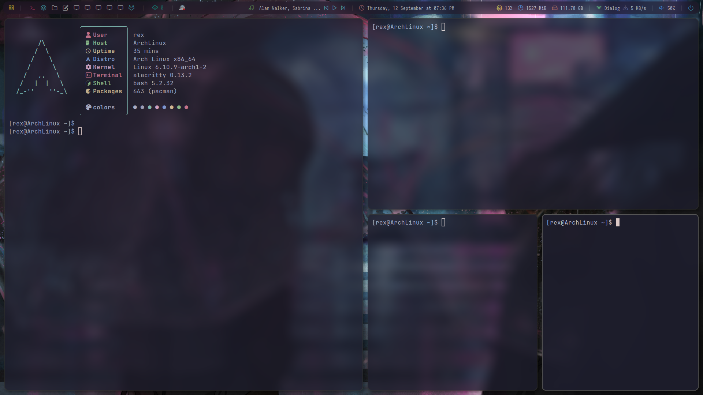

# My Dotfiles

This repository contains the configuration files I use for my Arch Linux setup with **BSPWM** as the window manager. These dotfiles are designed to keep my environment consistent across machines and can be easily cloned and used.

## Included Configurations

- **BSPWM**: Window manager setup (`~/.config/bspwm/bspwmrc`)
- **SXHKD**: Hotkey daemon (`~/.config/sxhkd/sxhkdrc`)
- **Polybar**: Status bar configuration (`~/.config/polybar/`)
- **Picom**: Compositor for transparency and effects (`~/.config/picom/picom.conf`)
- **Shell**: Custom shell configurations (`~/.bashrc`, `~/.zshrc`)

## Installation

You can clone this repository and use the bare repository method to keep your dotfiles in their original location without the need for symlinks:

1. **Clone the bare repository**:

   ```bash
   git clone --bare https://github.com/Deciper/dotfiles.git $HOME/.dotfiles
   ```

2. **Set up the alias**:

   ```bash
   alias dotfiles='/usr/bin/git --git-dir=$HOME/.dotfiles/ --work-tree=$HOME'
   ```

3. **Ensure Git ignores untracked files**:

   ```bash
   dotfiles config --local status.showUntrackedFiles no
   ```

4. **Backup conflicting files and checkout dotfiles** (choose **one** of the following):

   - **Option 1**: Backup existing files and checkout:
     ```bash
     mkdir -p ~/dotfiles-backup && dotfiles checkout 2>&1 | grep '^\s' | awk '{print $1}' | xargs -I{} mv {} ~/dotfiles-backup/{}
     ```

   - **Option 2**: Simply checkout dotfiles:
     ```bash
     dotfiles checkout
     ```

## Screenshots

Here are a few screenshots of my setup:

### BSPWM Desktop


### Polybar


### Terminal


## Usage

- **BSPWM**: Window manager controls.
- **SXHKD**: Custom key bindings.
- **Polybar**: Modular status bar configurations.
- **Picom**: Transparency and animations for windows.
- **Shell**: Shell configurations (bash/zsh) for prompt and aliases.

## License

Feel free to use, modify, and share these dotfiles. Contributions and suggestions are welcome!
